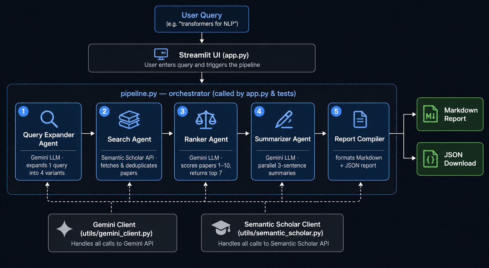

# 🔬 Collaborative Research Paper Finder

[](https://prashantgautam-research-finder.streamlit.app/)
[](https://www.python.org/)
[](LICENSE)

**A multi-agent pipeline that turns one research topic into a ranked, summarized literature shortlist.**
Type a topic; five specialized LLM agents expand it into 4 search angles, pull candidate papers
from Semantic Scholar, score every paper 1–10 for relevance, and return the **top 7** with
structured 3-sentence summaries and a downloadable JSON report — in a single click.

The contribution isn't a new model; it's a **clean, fault-tolerant agent orchestration**: every
LLM step degrades gracefully (a bad JSON response scores 0 and drops out instead of crashing the
run), and the slow step (summarization) is parallelized with `asyncio`.

> ### ▶️ [Try the live demo](https://prashantgautam-research-finder.streamlit.app/)


<!-- TODO: add docs/demo.png — a screenshot or GIF of one full run -->

---

## What it produces

For the query `attention mechanisms in deep learning`, one run returns a ranked report like:

| Rank | Paper | Year | Citations | Relevance |
|-----:|-------|-----:|----------:|:---------:|
| 1 | Attention Is All You Need | 2017 | 100,000+ | 10/10 |
| 2 | Neural Machine Translation by Jointly Learning to Align and Translate | 2014 | … | 9/10 |
| … | … | … | … | … |

…each with a one-line *why it's relevant* and a 3-sentence summary (problem → method → result),
plus a one-click **JSON download** of the full structured report.

> *Example only — exact papers, citation counts, and scores vary per run and are generated live.*

**Honest limitations**
- **No quantitative evaluation yet.** Relevance scores are the LLM's own judgment; there is no
  ground-truth benchmark, precision/recall, or human-rated baseline. Treat it as a smart first
  pass, not a systematic review.
- **Summaries can be wrong.** They're LLM-generated from abstracts — always verify against the
  original paper before citing.
- **Single source.** Only Semantic Scholar is queried (the earlier arXiv prototype lives in `archive/`).
- **Recall depends on the abstract.** Papers with no abstract still appear but get weaker scores
  and summaries.
- **Rate limits.** Without a Semantic Scholar key you get ~1 req/sec; the pipeline issues 4 searches
  per run, so cold runs can be slow.

---

## Architecture

Sequential pipeline, one orchestrator (`pipeline.py`), graceful fallback at every LLM step:



| Component | Technology |
|---|---|
| Interface | Streamlit |
| LLM | Google Gemini (`gemini-2.5-flash-lite`) |
| Paper search | Semantic Scholar Graph API |
| Concurrency | `asyncio` (parallel summarization) |
| Language | Python **3.9+** |

Scoring papers **one at a time** (rather than one giant prompt) is deliberate — it avoids the
long-context "lost in the middle" failure mode and keeps each judgment independent.

---

## How to run

**Prerequisites**
- Python 3.9+
- A free **Gemini API key** → https://aistudio.google.com/app/apikey *(required)*
- A free **Semantic Scholar API key** → https://www.semanticscholar.org/product/api
  *(optional — raises the rate limit from ~1 to ~100 req/sec)*

**Install & run**
```bash
git clone https://github.com/<your-username>/collaborative-research-paper-finder.git
cd collaborative-research-paper-finder
python -m venv venv && source venv/bin/activate   # Windows: venv\Scripts\activate
pip install -r requirements.txt
cp .env.example .env        # then paste your real keys into .env
streamlit run app.py
```

**Run the pipeline headless (no UI):**
```bash
python pipeline.py          # runs a built-in test query end to end
```

**Run the tests:**
```bash
pip install pytest
pytest                      # smoke-tests the pipeline with the two APIs mocked
```

**Caveats**
- Without `GEMINI_API_KEY` set, the app fails on the first agent — the key is mandatory.
- Free Gemini and keyless Semantic Scholar both rate-limit; a run makes ~11 LLM calls
  (1 expand + N rank + 7 summarize) plus 4 searches.

---

## File structure

```
.
├── app.py                       # Streamlit UI + entry point; renders results, JSON download
├── pipeline.py                  # Orchestrator: runs all 5 agents in sequence; also runnable headless
├── agents/
│   ├── query_expander.py        # Agent 1 — Gemini turns 1 topic into 4 search phrasings
│   ├── search_agent.py          # Agent 2 — queries Semantic Scholar, dedupes by paper_id
│   ├── ranker_agent.py          # Agent 3 — scores each paper 1–10, returns top 7
│   ├── summarizer_agent.py      # Agent 4 — parallel 3-sentence summaries via asyncio
│   └── report_compiler.py       # Agent 5 — formats markdown + JSON report (no LLM)
├── utils/
│   ├── gemini_client.py         # Shared Gemini client + model constant
│   └── semantic_scholar.py      # Semantic Scholar Graph API wrapper, fault-tolerant
├── tests/
│   └── test_pipeline.py         # Smoke test: full pipeline end to end with both APIs mocked
├── archive/                     # Earlier single-file arXiv prototype (not used by the app)
├── requirements.txt             # Python dependencies
├── .env.example                 # Template for the two API keys
└── README.md
```

---

## What's next
- [ ] **Add an evaluation harness** (`evaluate.py`) with a small labeled query set so relevance
      scores can be measured, not just asserted — this is the single biggest credibility upgrade.
- [ ] **Multi-source search** — add arXiv / OpenAlex alongside Semantic Scholar and merge.
- [ ] **Cache** API responses to cut repeat-run latency and rate-limit pressure.
- [ ] **Pin exact dependency versions** and add CI (lint + the pipeline smoke test).
- [ ] Let the user tune *N expansions* and *top-K* from the UI.

---

## References
- [Semantic Scholar Graph API](https://api.semanticscholar.org/api-docs/)
- [Google Gemini API](https://ai.google.dev/)
- [Streamlit](https://docs.streamlit.io/)

## License
MIT — see [LICENSE](LICENSE).
